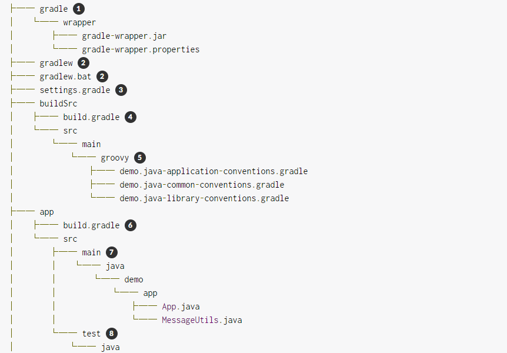
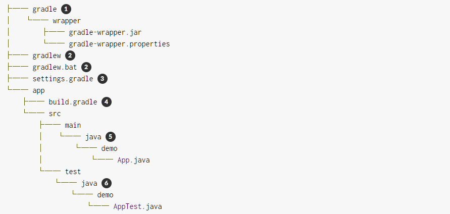
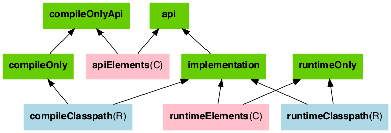
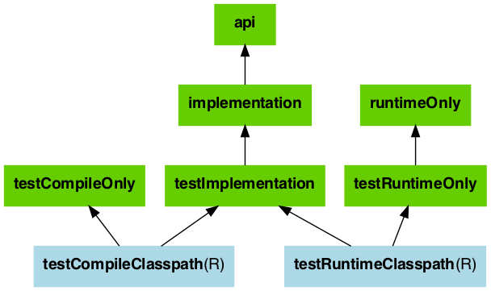
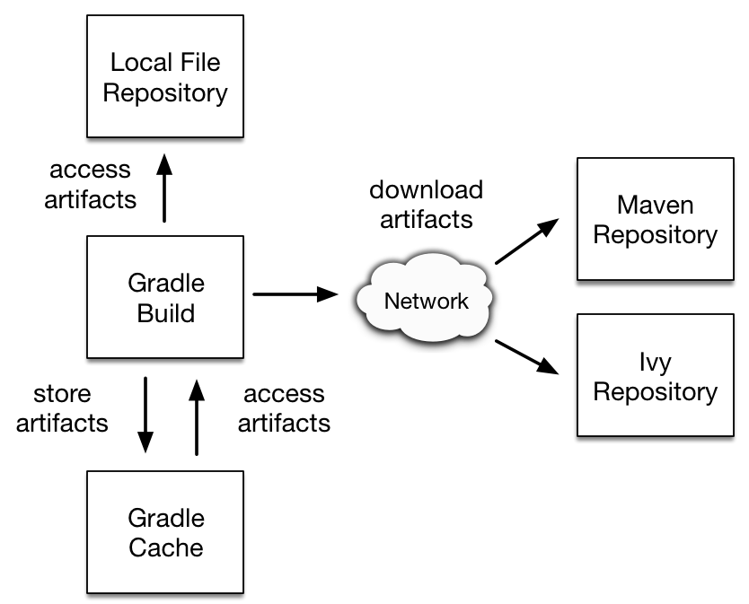
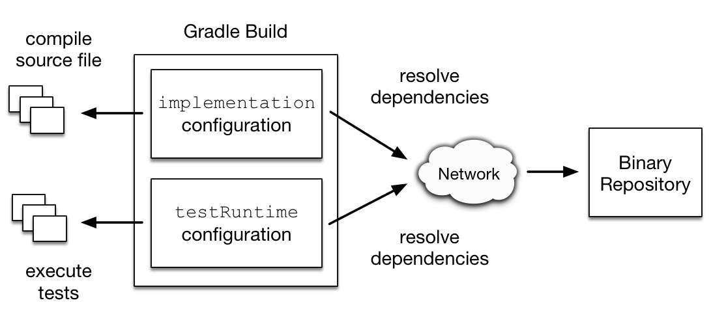
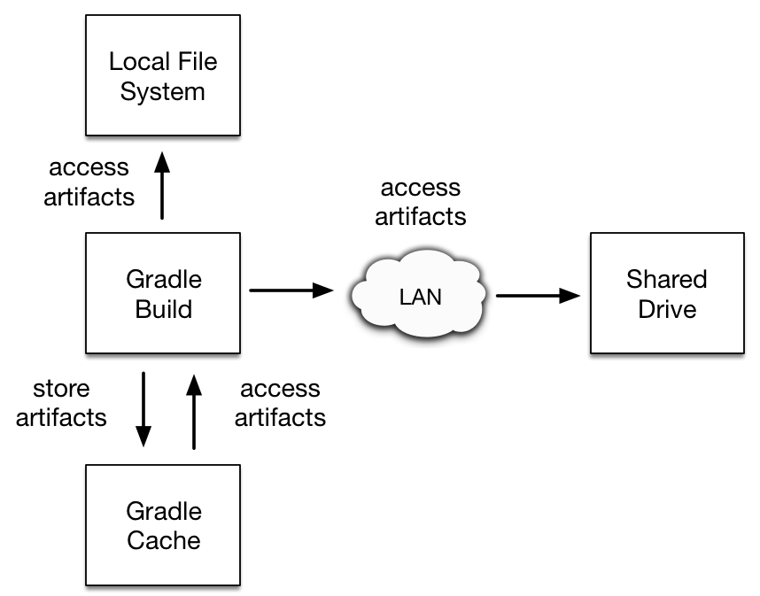

# Gradle


## 一、项目结构



1. 包装文件的生成文件夹

2. Gradle包装器启动脚本

3. 设置文件以定义构建名称和子项目

   ```groovy
   rootProject.name = 'demo'  // 根项目名称
   include('app', 'list', 'utilities')  // 包含的子项目，也可以分开按行写，同下两行
   // include 'app'
   // lude 'list'
   ```

4. buildSrc的构建脚本以配置构建逻辑的依赖关系

   ```groovy
   %  buildSrc /build.gradle
   
   plugins {
       id 'groovy-gradle-plugin'  // 通过这个插件，支持编写约定插件
   }
   
   repositories {
       gradlePluginPortal()  // 添加依赖库
   }
   ```

5. 用Groovy或Kotlin DSL编写的约定插件的源文件夹

   ```groovy
   %  buildSrc /src/main/groovy/demo.java-common-conventions.gradle
   
   plugins {
       id 'java'  // Java插件，用于构建Java项目的功能
   }
   
   repositories {
       jcenter()  // 存储库，作为外部依赖项的源
   }
   
   dependencies {  // 标准依赖项
       testImplementation 'org.junit.jupiter:junit-jupiter-api:5.6.2' 
       testRuntimeOnly 'org.junit.jupiter:junit-jupiter-engine' 
   }
   
   tasks.named('test') {
       useJUnitPlatform() 
   }
   ```

   ```groovy
   %  buildSrc /src/main/groovy/demo.java-library-conventions.gradle
   
   plugins {
       id 'demo.java-common-conventions'  // 引用上面定义的common插件，共享通用配置
       id 'java-library'  // 更细的分类插件引用
   }
   ```

   ```groovy
   %  buildSrc /src/main/groovy/demo.java-application-conventions.gradle
   
   plugins {
       id 'demo.java-common-conventions' 
       id 'application' 
   }
   ```

6. 三个子项目的构建脚本app，list以及utilities

   ```groovy
   %  app/build.gradle
   
   plugins {  // 每个构建脚本都应有一个plugins{}块来应用插件
       id 'demo.java-application-conventions'
   }
   
   dependencies { // 项目依赖
       implementation project(':utilities')
   }
   
   application {
       mainClass = 'demo.app.App'  // 插件可能有一个或多个配置块。仅当它们为一个项目配置特定的东西时，才应直接在构建脚本中使用它们。否则，此类配置也属于约定插件。在这个例子中，我们使用的application {}块，这是特定的application插件，设置mainClass在我们的app项目demo.app.App
   }
   ```

7. 每个子项目中的Java源文件夹

8. 子项目中的Java测试源文件夹

### 1.1 Java项目结构



1. 包装文件的生成文件夹

2.  Gradle包装器启动脚本

3. 设置文件以定义构建名称和子项目

   ```groovy
   %  settings.gradle
   
   rootProject.name = 'demo'  // 根项目名称
   include('app')  // 包含的子项目，也可以分开按行写，同下行
   // include 'app'
   ```

4. `app`项目的构建脚本

   ```groovy
   %  app/build.gradle
   
   plugins {
       id 'application' // <1>
   }
   
   repositories {
       jcenter() // <2>
   }
   
   dependencies {
       testImplementation 'junit:junit:4.13' // <3>
   
       implementation 'com.google.guava:guava:29.0-jre' // <4>
   }
   
   application {
       mainClass = 'demo.App' // <5>
   }
   ```

`settings.gradle` 根项目构建脚本，公共依赖、根项目管理等

```groovy
%  settings.gradle

buildscript {
    repositories {
        mavenLocal()
    }
    dependencies {
        classpath("org.springframework.boot:spring-boot-gradle-plugin:2.1.4.RELEASE")
    }
}

// 管理所有的子模块
subprojects {
    group 'com.joker'
    version '1.0.0'
    apply plugin: 'java-library'
    apply plugin: 'maven'
    sourceCompatibility = 1.8
    targetCompatibility = 1.8
    [compileJava, compileTestJava]*.options*.encoding = 'UTF-8'

    repositories {
        mavenLocal()
        mavenCentral()
        maven {
            url "http://repo.mycompany.com/maven2"
            credentials {
                username "user"
                password "password"
            }
        }
    }

    apply plugin: 'io.spring.dependency-management'
    // 只是声明依赖，并不引入，子项目需要显示声明并且不指定版本才会从父项目继承，否则会使用子项目自己的依赖项
    dependencyManagement {
        imports {
            mavenBom "org.springframework.boot:spring-boot-starter-web:2.3.3.RELEASE"
        }
    }

    // 通用依赖，会直接给子项目引入该依赖项
    dependencies {
        // 第三方依赖包
        compileOnly 'org.projectlombok:lombok:1.18.10'
        annotationProcessor 'org.projectlombok:lombok:1.18.10'

        // 单元测试
        testImplementation("org.springframework.boot:spring-boot-starter-test") {
            exclude group: 'org.skyscreamer'
        }
        testCompileOnly 'org.projectlombok:lombok:1.18.10'
        testAnnotationProcessor 'org.projectlombok:lombok:1.18.10'
    }

    jar {
        enabled = true
    }
}
```


## 二、Gradle构建基础

### 2.1 Hello world!

```groovy
task hello {
    doLast {
        println 'Hello world!'
    }
}
```

```bash
# 执行
> gradle -q hello
Hello world!
```

gradle脚本支持所有Groovy功能。

#### 2.1.1 任务依赖性

```groovy
task hello {
    doLast {
        println 'Hello world!'
    }
}
task intro {
    dependsOn hello // 可以在hello定义声明前依赖
    doLast {
        println "I'm Gradle"
    }
}
```

```bash
# 执行
> gradle -q intro
Hello world!
I'm gradle
```

#### 2.1.2 动态任务

```groovy
4.times { counter ->
    task "task$counter" {
        doLast {
            println "I'm task number $counter"
        }
    }
}
```

```bash
# 执行
>gradle -q task1
I'm task number 1
```

#### 2.1.3 也可以处理现有任务

```groovy
// 复用2.1.2内容
task0.dependsOn task2, task3
```

```bash
# 执行
> gradle -q task0
I'm task number 2
I'm task number 3
I'm task number 0
```

#### 2.1.4 通过API访问任务，添加行为

```gr
task hello {
    doLast {
        println 'Hello Earth'
    }
}
hello.doFirst {
    println 'Hello Venus'
}
hello.configure {
    doLast {
        println 'Hello Mars'
    }
}
hello.configure {
    doLast {
        println 'Hello Jupiter'
    }
}
```

```bash
# 执行
> gradle -q hello
Hello Venus
Hello Earth
Hello Mars
Hello Jupiter
```

#### 2.1.5 额外任务属性

https://docs.gradle.org/current/userguide/writing_build_scripts.html#sec:extra_properties

```groovy
task myTask {
    ext.myProperty = "myValue"
}

task printTaskProperties {
    doLast {
        println myTask.myProperty
    }
}
```

```bash
# 执行
> gradle -q printTaskProperties
myValue
```

#### 2.1.6 默认任务

gradle时不指定任务，则执行定义的一个或多个默认任务

```groovy
defaultTasks 'clean', 'run'

task clean {
    doLast {
        println 'Default Cleaning!'
    }
}

task run {
    doLast {
        println 'Default Running!'
    }
}

task other {
    doLast {
        println "I'm not a default task!"
    }
}
```

```bash
# 执行
> gradle -q
Default Cleaning!
Default Running!
```

#### 2.1.7 构建脚本的外部依赖关系

`buildscript()`方法配置外部依赖项

```groovy
import org.apache.commons.codec.binary.Base64

buildscript {
    repositories {
        mavenCentral()
    }
    dependencies {
        classpath group: 'commons-codec', name: 'commons-codec', version: '1.2'
    }
}

task encode {
    doLast {
        def byte[] encodedString = new Base64().encode('hello world\n'.getBytes())
        println new String(encodedString)
    }
}
```


## 三、构建JVM

### 3.1 构建Java项目

Java项目的最简单构建脚本将使用Java库插件，并可以选择设置项目版本和要使用的Java工具链。

[了解更多](https://docs.gradle.org/current/userguide/building_java_projects.html)

#### 3.1.1 介绍

```groovy
plugins {
    id 'java-library'
}

java {
    toolchain {
        languageVersion = JavaLanguageVersion.of(11)
    }
}

version = '1.2.1'
```

通过应用Java库插件，您可以获得许多功能：

- 一`compileJava`，编译下的所有Java源文件任务*的src / main / JAVA*
- 一`compileTestJava`对在源文件任务*的src / test / java下*
- 一个`test`运行从测试任务*的src / test / java下*
- 将来自*src / main / resources*`jar`的已`main`编译类和资源打包到名为*<project>-<version> .jar*的单个JAR中的任务
- `javadoc`为`main`类生成Javadoc的任务

> 尽管示例中的属性是可选的，但我们建议您在项目中指定它们。工具链选项可防止使用不同Java版本构建的项目出现问题。版本字符串对于跟踪项目的进度很重要。默认情况下，项目版本也用于归档名称中。

#### 3.1.2 通过源集声明源文件

！！！！待学习 ！！！！

#### 3.1.3 管理你的依赖

为Java项目指定依赖项仅需要三点信息：

- 您需要哪个依赖项，例如名称和版本
- 它需要什么，例如编译或运行
- 在哪里寻找

前两个在`dependencies {}`块中指定，第三个在`repositories {}`块中指定。

```groovy
repositories { // 依赖仓库地址
    mavenCentral()
}

dependencies { // 依赖项的名称org.hibernate:hibernate-core、版本3.6.7.Final和需要干什么implementation
    implementation 'org.hibernate:hibernate-core:3.6.7.Final'
}
```

三个元素的Gradle术语如下：

- *存储库*（例如：`mavenCentral()`）—在哪里查找声明为依赖项的模块
- *配置*（例如：`implementation`）-命名的依赖项集合，针对特定目标（如编译或运行模块）分组在一起-一种更灵活的Maven范围形式
- *模块坐标*（ex：`org.hibernate:hibernate-core-3.6.7.Final`）—依赖项的ID，通常采用' *<group>*：*<module>*：*<version>* '的形式（或在Maven术语中为' *<groupId>*：*<artifactId>*：*<version>* '）

主要的依赖配置：

- `compileOnly` —用于编译生产代码所必需的依赖关系，但不应该属于运行时类路径的一部分
- `implementation`（取代`compile`）-用于编译和运行时
- `runtimeOnly`（取代`runtime`）-仅在运行时使用，不用于编译
- `testCompileOnly`—与`compileOnly`测试相同
- `testImplementation` —测试相当于 `implementation`
- `testRuntimeOnly` —测试相当于 `runtimeOnly`

> **为什么抛弃`compile`配置？**
>
> Java库插件在历史上一直使用该`compile`配置作为编译和运行项目生产代码所需的依赖项。现在已弃用它，并且在使用时会发出警告，因为它不能区分影响Java库项目的公共API的依赖项和不影响Java库项目的公共API的依赖项。您可以在[构建Java库中](https://docs.gradle.org/current/userguide/building_java_projects.html#sec:building_java_libraries)了解有关此区别的重要性的更多信息。

#### 3.1.4 编译代码

如果遵循以下约定，则可以同时轻松地编译生产代码和测试代码：

1. 将生产源代码放在*src / main / java*目录下
2. 将您的测试源代码放在*src / test / java下*
3. 在`compileOnly`或`implementation`配置中声明您的生产编译依赖项（请参见上一节）
4. 在`testCompileOnly`或`testImplementation`配置中声明您的测试编译依赖项
5. 运行`compileJava`生产代码和`compileTestJava`测试的任务

**自定义源目录：**

*方法* `srcDir()`来附加目录路径，而设置`srcDirs`属性将替换所有现有值

```groovy
sourceSets {
    main {
         java {
            srcDirs = ['src'] // 直接覆盖约定
            srcDir 'thirdParty/src/main/java' // 额外添加一个源目录
         }
    }

    test {
        java {
            srcDirs = ['test']
        }
    }
}
```

**更改编译器选项：**

https://docs.gradle.org/current/dsl/org.gradle.api.tasks.compile.JavaCompile.html

```groovy
// 为编译器使用单独的JVM进程并防止编译失败使构建失败
compileJava {
    options.incremental = true
    options.fork = true
    options.failOnError = false
}
```

**定位特定的Java版本：**

默认情况下，Gradle将Java代码编译为运行Gradle的JVM语言版本。

从版本9开始，可以将Java编译器配置为生成旧Java版本的字节码，同时确保该代码不使用更新版本的任何API。Gradle现在直接在Java编译上支持此[发行](https://docs.gradle.org/current/dsl/org.gradle.api.tasks.compile.CompileOptions.html#org.gradle.api.tasks.compile.CompileOptions:release)标志`CompileOptions`。此选项优先于下面描述的属性。

```groovy
compileJava {
    options.release = 7
}
```

Java编译器的历史选项仍然可用：

- `sourceCompatibility`

  定义应将源文件视为Java的语言版本。

- `targetCompatibility`

  定义您的代码应在其上运行的最低JVM版本，即，它确定编译器生成的字节码的版本。

这些选项可以使用相同名称的属性针对每个[JavaCompile](https://docs.gradle.org/current/dsl/org.gradle.api.tasks.compile.JavaCompile.html)任务或在`java { }`所有编译任务的扩展名上进行设置。

**分别编译独立的源:**

大多数项目至少有两个独立的源集：生产代码和测试代码。Gradle已经将此场景作为其Java约定的一部分，但是如果您有其他来源的话该怎么办？最常见的情况之一是当您进行某种形式或其他形式的单独集成测试时。在这种情况下，自定义源集可能正是您所需要的。

您可以在[Java测试一章中](https://docs.gradle.org/current/userguide/java_testing.html#sec:configuring_java_integration_tests)看到设置集成测试的完整示例。您可以设置以相同方式担当不同角色的其他源集。问题就变成了：您何时应该定义自定义源集？

要回答该问题，请考虑以下来源：

1. 需要使用唯一的类路径进行编译
2. 生成与`main`和处理不同的`test`类
3. 构成项目的自然组成部分

如果您对3和其他任何一个的回答都是肯定的，那么自定义源集可能是正确的方法。例如，集成测试通常是项目的一部分，因为它们测试中的代码`main`。此外，它们通常具有独立于`test`源集的自己的依赖关系，或者需要与自定义`Test`任务一起运行。

其他常见方案不太明确，可能有更好的解决方案。例如：

- 单独的API和实现JAR –将它们作为单独的项目可能是有意义的，特别是如果您已经具有多项目构建
- 生成的源-如果生成的源应使用生产代码进行编译，则将其路径添加到`main`源集中，并确保`compileJava`任务依赖于生成源的任务

如果不确定是否要创建自定义源集，请继续进行操作。它应该简单明了，如果不是，则可能不是适合该工作的工具。

#### 3.1.5 管理资源

https://docs.gradle.org/current/userguide/building_java_projects.html#sec:java_resources


### 3.2 测试Java项目

主要介绍Gradle如何与JUnit集成

### 3.3 Java项目的工具链


### 3.4 管理JVM项目的依赖关系

#### 3.4.1 典型的构建脚本

它应用了java-library插件，该插件会自动引入标准项目布局。

```groovy
plugins {
    id 'java-library'
}

repositories {
    mavenCentral()
}

dependencies {
    implementation 'org.hibernate:hibernate-core:3.6.7.Final'
    api 'com.google.guava:guava:23.0'
    testImplementation 'junit:junit:4.+'
}
```

#### 3.4.2 依赖项配置

一个配置是一组命名的依赖和文物。有一个三个主要目的*配置*：

- 声明依赖

  插件使用配置使构建作者可以轻松地声明在执行插件定义的任务期间出于各种目的还需要其他哪些子项目或外部工件。例如，一个插件可能需要Spring Web框架依赖项来编译源代码。

- 解决依赖性

  插件使用配置来查找（并可能下载）对其定义的任务的输入。例如，Gradle需要从Maven Central下载Spring Web框架JAR文件。

- 暴露文物以供消费

  插件使用配置来定义它生成供其他项目使用的*工件*。例如，该项目希望将其打包在JAR文件中的已编译源代码发布到内部Artifactory存储库中。

考虑到这三个目的，让我们看一下[Java库插件定义](https://docs.gradle.org/current/userguide/java_library_plugin.html#sec:java_library_configurations_graph)的一些[标准配置](https://docs.gradle.org/current/userguide/java_library_plugin.html#sec:java_library_configurations_graph)。

- **implementation**

  编译项目生产源所需的依赖项，这些依赖项*不是*项目公开的API的一部分。例如，该项目将Hibernate用于其内部持久层实现。

- **api**

  所需要的依赖关系来编译该项目其生产来源*是*由项目露出的API的一部分。例如，该项目使用Guava，并在其方法签名中公开带有Guava类的公共接口。

- **testImplementation**

  编译和运行项目的测试源所需的依赖项。例如，该项目决定使用测试框架JUnit编写测试代码。

#### 3.4.3 声明通用Java存储库

Gradle在存储库中找到外部依赖文件。库是模块，通过组织的集合`group`，`name`和`version`。Gradle支持不同的存储库类型，例如Maven和Lvy，并支持通过HTTP或其他协议访问存储库。

默认情况下，Gradle不定义任何存储库。您需要在`Project.repositories {}`的帮助下定义至少一个，然后才能使用模块依赖项。一种选择是使用Maven Central存储库：

```groovy
repositories {
    mavenLocal() // 本地存储库
    mavenCentral() // maven中央仓库
}
```

基于HTTP的Maven仓库，将SFTP协议用于存储库：

```groovy
repositories {
    mavenLocal()
    maven {
        credentials {
            username "user"
            password "password"
        }
        url "url"
    }
}
```

更多详见4.2[声明存储库](#42-声明存储库)。

### 3.5 JAVA插件

使用Java库插件，构建脚本需包含：

```groovy
plugins {
    id 'java-library'
}
```

[了解更多](https://docs.gradle.org/current/userguide/java_library_plugin.html)

#### 3.5.1 API和implementation分离

标准Java插件和Java库插件之间的主要区别在于，后者引入了向消费者公开的*API*的概念。库是一个Java组件，打算由其他组件使用。在多项目构建中，这是一个非常常见的用例，但在您具有外部依赖关系时也是如此。

该插件公开了两个配置可用于声明的依赖性：`api`和`implementation`。该`api`配置应用于声明由库API导出的依赖关系，而该`implementation`配置应用于声明组件内部的依赖关系。

```groovy
dependencies {
    api 'org.apache.httpcomponents:httpclient:4.5.7' // api依赖
    implementation 'org.apache.commons:commons-lang3:3.5' // 实现依赖
}
```

`api`配置中出现的依赖项将传递给库的使用者，并因此出现在使用者的编译类路径上。`implementation`另一方面，在配置中找到的依赖项不会暴露给使用者，因此不会泄漏到使用者的编译类路径中。这有几个好处：

- 依赖项不会再泄漏到使用者的编译类路径中，因此您永远不会意外地依赖于传递性依赖项
- 减少类路径大小，加快了编译速度
- 实施依赖项发生更改时，重新编译次数更少：无需重新编译使用者
- 更清洁的发布：与新`maven-publish`插件一起使用时，Java库产生的POM文件可以准确地区分针对该库进行编译所需的内容和在运行时使用该库所需的内容（换句话说，请勿混用需要对库本身进行编译以及对库进行编译所需的内容）。

> 该`compile`配置仍然存在，但不应使用，因为它不能提供`api`和`implementation`配置所提供的保证。

如果您的构建使用带有POM元数据的已发布模块，则Java和Java库插件会通过pom中使用的作用域来实现api和实现分离。这意味着编译类路径仅包含`compile`范围内的依赖关系，而运行时类路径也添加`runtime`范围内的依赖关系。

这通常对用Maven发布的模块没有影响，在Maven中，定义项目的POM直接作为元数据发布。在那里，编译范围既包括编译项目所需的依赖关系（即实现依赖关系），又包括针对已发布库进行编译所需的依赖关系（即API依赖关系）。对于大多数已发布的库，这意味着所有依赖项都属于编译范围。如果您在现有库中遇到此类问题，则可以考虑使用[组件元数据规则](https://docs.gradle.org/current/userguide/component_metadata_rules.html#sec:component_metadata_rules)来修复构建中不正确的元数据。但是，如上所述，如果该库是与Gradle一起发布的，则生成的POM文件只会将`api`依赖项放入编译范围，而将其余`implementation`依赖项放入运行时范围。

#### 3.5.2 区分API和implementation依赖

**尽可能优先使用`implementation`配置`api`**

这使依赖脱离消费者的编译路径

使用api的场景，API依赖关系是至少包含一种在库二进制接口（通常称为ABI（应用程序二进制接口））中公开的类型。This includes, but is not limited to:

- 超类或接口中使用的类型
- 公共方法参数中使用的类型，包括通用参数类型（其中*public*是编译器可见的东西。即Java世界中的*public*，*protected*和*package private*成员）
- 公共领域中使用的类型
- 公开注释类型

相比之下，以下列表中使用的任何类型均与ABI不相关，因此应将其声明为`implementation`依赖项：

- 方法主体中专门使用的类型
- 专用于私人会员的类型
- 内部类专有的类型（将来的Gradle版本将允许您声明哪些包属于公共API）

以下类使用了几个第三方库，其中一个在类的公共API中公开，另一个仅在内部使用。import语句无法帮助我们确定哪个是哪个，因此我们必须查看字段，构造函数和方法：

```java
%  src/main/java/org/gradle/HttpClientWrapper.java

// The following types can appear anywhere in the code
// but say nothing about API or implementation usage
import org.apache.commons.lang3.exception.ExceptionUtils;
import org.apache.http.HttpEntity;
import org.apache.http.HttpResponse;
import org.apache.http.HttpStatus;
import org.apache.http.client.HttpClient;
import org.apache.http.client.methods.HttpGet;

import java.io.ByteArrayOutputStream;
import java.io.IOException;
import java.io.UnsupportedEncodingException;

public class HttpClientWrapper {

    private final HttpClient client; // private member: implementation details

    // HttpClient is used as a parameter of a public method
    // so "leaks" into the public API of this component
    public HttpClientWrapper(HttpClient client) {
        this.client = client;
    }

    // public methods belongs to your API
    public byte[] doRawGet(String url) {
        HttpGet request = new HttpGet(url);
        try {
            HttpEntity entity = doGet(request);
            ByteArrayOutputStream baos = new ByteArrayOutputStream();
            entity.writeTo(baos);
            return baos.toByteArray();
        } catch (Exception e) {
            ExceptionUtils.rethrow(e); // this dependency is internal only
        } finally {
            request.releaseConnection();
        }
        return null;
    }

    // HttpGet and HttpEntity are used in a private method, so they don't belong to the API
    private HttpEntity doGet(HttpGet get) throws Exception {
        HttpResponse response = client.execute(get);
        if (response.getStatusLine().getStatusCode() != HttpStatus.SC_OK) {
            System.err.println("Method failed: " + response.getStatusLine());
        }
        return response.getEntity();
    }
}
```

用途的*公共*构造函数作为参数，因此它对使用者公开，因此属于API。请注意，和用于*私有*方法的签名中，因此它们不计入使HttpClient成为API依赖项。`HttpClientWrapper``HttpClient``HttpGet``HttpEntity`

另一方面，`ExceptionUtils`来自`commons-lang`库的类型仅用于方法主体（而不用于其签名），因此它是实现依赖项。

因此，我们可以推断出这`httpclient`是API依赖性，而是`commons-lang`实现依赖性。

```groovy
dependencies {
    api 'org.apache.httpcomponents:httpclient:4.5.7'
    implementation 'org.apache.commons:commons-lang3:3.5'
}
```

#### 3.5.3 Java库插件配置

1. 下图描述了使用Java库插件时如何配置：



- *绿色*的配置是用户应用来声明依赖项的配置
- *粉红色*的配置是组件编译或针对库运行时使用的配置
- *蓝色*的配置位于组件内部，供其自己使用

2. 下图描述了测试配置：



> 从Java插件继承的*compile*，*testCompile*，*runtime*和*testRuntime*配置仍然可用，但已弃用。您应避免使用它们，因为仅保留它们是为了向后兼容。

下表描述了每种配置的作用：

*表1. Java库插件-用于声明依赖关系的配置*

| 配置名称             | 角色                 | 消耗品？ | 可解决的？ | 描述                                                         |
| :------------------- | :------------------- | :------- | :--------- | :----------------------------------------------------------- |
| `api`                | 声明API依赖项        | 没有     | 没有       | 在这里，您可以声明依赖关系，这些依赖关系会在编译时和运行时以可传递方式导出到使用者。 |
| `implementation`     | 声明实现依赖         | 没有     | 没有       | 在这里，您可以声明纯属内部的依赖关系，而不是要向使用方公开（在运行时仍向使用方公开）。 |
| `compileOnly`        | 声明仅编译依赖项     | 没有     | 没有       | 在这里可以声明在编译时需要的依赖项，而在运行时则不需要。这通常包括在运行时找到时会被阴影化的依赖项。 |
| `compileOnlyApi`     | 声明仅编译API依赖项  | 没有     | 没有       | 在这里，您可以声明模块和使用者在编译时需要的依赖项，而在运行时则不需要。这通常包括在运行时找到时会被阴影化的依赖项。 |
| `runtimeOnly`        | 声明运行时依赖项     | 没有     | 没有       | 在这里可以声明仅在运行时才需要的依赖关系，而在编译时则不需要。 |
| `testImplementation` | 测试依赖             | 没有     | 没有       | 在此处声明用于编译测试的依赖项。                             |
| `testCompileOnly`    | 声明测试仅编译依赖项 | 没有     | 没有       | 在这里，您可以声明依赖项，这些依赖项仅在测试编译时才需要，但不应泄漏到运行时中。这通常包括在运行时找到时会被阴影化的依赖项。 |
| `testRuntimeOnly`    | 声明测试运行时依赖项 | 没有     | 没有       | 在这里，您可以声明仅在测试运行时才需要的依赖项，而在测试编译时则不需要。 |

*表2. Java库插件—使用者使用的配置*

| 配置名称          | 角色                 | 消耗品？ | 可解决的？ | 描述                                                         |
| :---------------- | :------------------- | :------- | :--------- | :----------------------------------------------------------- |
| `apiElements`     | 用于针对该库进行编译 | 是       | 没有       | 此配置供使用者使用，以检索对该库进行编译所需的所有元素。与`default`配置不同，这不会泄漏实现或运行时依赖项。 |
| `runtimeElements` | 用于执行此库         | 是       | 没有       | 使用者将使用此配置来检索对该库运行所需的所有元素。           |

*表3. Java库插件-库本身使用的配置*

| 配置名称             | 角色               | 消耗品？ | 可解决的？ | 描述                                                         |
| :------------------- | :----------------- | :------- | :--------- | :----------------------------------------------------------- |
| compileClasspath     | 用于编译该库       | 没有     | 是         | 此配置包含此库的编译类路径，因此在调用java编译器进行编译时使用。 |
| runtimeClasspath     | 用于执行此库       | 没有     | 是         | 此配置包含此库的运行时类路径                                 |
| testCompileClasspath | 用于编译该库的测试 | 没有     | 是         | 此配置包含此库的测试编译类路径。                             |
| testRuntimeClasspath | 用于执行此库的测试 | 没有     | 是         | 此配置包含此库的测试运行时类路径                             |

### 3.6 Java应用程序插件


## 四、使用依赖项

软件项目很少单独工作。在大多数情况下，项目依赖于库形式的可重用功能，或者分解为单个组件以构成模块化系统。依赖性管理是一种用于以自动化方式声明，解决和使用项目所需依赖性的技术。



[了解更多](https://docs.gradle.org/current/userguide/core_dependency_management.html) 

### 4.1 声明存储库

Gradle可以基于Maven，Ivy或平面目录格式解析来自一个或多个存储库的依赖项。

[了解更多](https://docs.gradle.org/current/userguide/declaring_repositories.html) 

#### 4.1.1 声明一个而公共可用的存储库

构建软件的组织可能希望利用公共二进制存储库来下载和使用开源依赖项。

流行的公共存储库包括：

```groovy
mavenCentral() // Maven Central
jcenter() // JCenter Maven
google() // Google Maven
```

#### 4.1.2 通过URL声明自定义存储库

大多数企业都会建立一个内网的仓库，可以让团队发布内部二进制文件，设置用户管理和安全措施并确保正常运行时间和可用性。这时就需要指定自定义URL的存储库。

通过调用[RepositoryHandler](https://docs.gradle.org/current/dsl/org.gradle.api.artifacts.dsl.RepositoryHandler.html) API上可用的相应方法，可以将具有自定义URL的存储库指定为Maven或Ivy存储[库](https://docs.gradle.org/current/dsl/org.gradle.api.artifacts.dsl.RepositoryHandler.html)。Gradle支持其他协议，而不是自定义URL`http`或`https`作为自定义URL的一部分，例如`file`，`sftp`或`s3`。有关完整信息，请参见[有关受支持的存储库类型](https://docs.gradle.org/current/userguide/declaring_repositories.html#sec:repository-types)的[部分](https://docs.gradle.org/current/userguide/declaring_repositories.html#sec:repository-types)。

#### 4.1.3 声明多个存储库

```groovy
repositories {
    jcenter()
    maven {
        url "https://maven.springframework.org/release"
    }
    maven {
        url "https://maven.restlet.com"
    }
}
```

> 声明的顺序决定了Gradle在运行时如何检查依赖关系。如果Gradle在特定存储库中找到模块描述符，它将尝试从*同一存储库*下载该模块的所有工件。您可以了解有关[依赖项下载](https://docs.gradle.org/current/userguide/dependency_resolution.html#sec:how-gradle-downloads-deps)的内部工作的更多信息。

#### 4.1.4 Maven仓库

许多组织将依赖项托管在内部Maven存储库中，该存储库只能在公司的网络中访问。Gradle可以通过URL声明Maven存储库。

**设置复合Maven存储库：**

有时，存储库会将POM发布到一个位置，并将JAR和其他工件发布到另一位置。要定义这样的存储库，您可以执行以下操作：

```groovy
repositories {
    maven {
        // Look for POMs and artifacts, such as JARs, here
        url "http://repo2.mycompany.com/maven2"
        // Look for artifacts here if not found at the above location
        artifactUrls "http://repo.mycompany.com/jars"
        artifactUrls "http://repo.mycompany.com/jars2"
    }
}
```

#### 4.1.5 本地Maven仓库

Gradle可以使用本地Maven存储库中可用的依赖项。声明此存储库对于使用一个项目发布到本地Maven存储库并在另一个项目中使用Gradle使用工件的团队来说是有益的。

> Gradle将已解决的依赖性存储在[其自己的缓存中](https://docs.gradle.org/current/userguide/dependency_resolution.html#sec:dependency_cache)。即使您从基于Maven的远程存储库中解决依赖关系，构建也无需声明本地Maven存储库。

```groovy
repositories {
    mavenLocal()
}
```

Gradle使用与Maven相同的逻辑来标识本地Maven缓存的位置。如果在中定义了本地存储库位置`settings.xml`，则将使用该位置。在`settings.xml`中`*USER_HOME*/.m2`优先于`settings.xml`中`*M2_HOME*/conf`。如果没有`settings.xml`可用的，Gradle将使用默认位置`*USER_HOME*/.m2/repository`。

**mavenLocal()**

一般应避免添加mavenLocal()作为存储库。使用`mavenLocal()`时应注意不同的问题：

- Maven将其用作缓存而不是存储库，这意味着它可以包含部分模块。
  - 例如，如果Maven从不下载给定模块的源文件或javadoc文件，则Gradle将不会找到它们，因为一旦找到模块，它就会在单个存储库中搜索文件。
- 作为本地存储库，Gradle不信任其内容，因为：
  - 无法跟踪工件的来源，这是正确性和安全性问题
  - 工件很容易被覆盖，这是一个安全性，正确性和可再现性问题
- 为了减轻该元数据和/或伪影可以改变的，摇篮不执行的事实任何缓存对本地资源库
  - 因此，您的构建速度较慢
  - 鉴于存储库的顺序很重要，因此`mavenLocal()` *首先*添加意味着您的所有构建都将变慢

在某些情况下，您可能需要使用`mavenLocal()`：

- 为了与Maven互操作
  - 例如，项目A使用Maven构建，项目B使用Gradle构建，并且您需要在开发过程中共享工件。
  - 它*总是*最好使用一个内部功能齐全的仓库，而不是
  - 如果无法做到这一点，则应将其限制为*仅本地构建*
- 为了与Gradle本身互操作
  - 在多存储库环境中，您要检查对项目A所做的更改是否与项目B一起使用
  - 对于此用例，最好使用复合构建
  - 如果由于某种原因，既无法构建复合版本，也无法使用功能全面的存储库，那么这`mavenLocal()`是最后的选择

在所有这些警告之后，如果最终使用过`mavenLocal()`，请考虑将其与[存储库过滤器](https://docs.gradle.org/current/userguide/declaring_repositories.html#sec:repository-content-filtering)结合使用。这将确保它仅提供预期的内容，而不提供其他任何内容。

#### 4.1.6 存储库内容过滤

Gradle公开了一个API，以声明存储库可能包含或不包含的内容。有不同的用例：

- 性能，当您知道在特定存储库中永远找不到依赖项时
- 通过避免泄漏私有项目中使用的依赖项来确保安全性
- 可靠性，当某些存储库包含损坏的元数据或工件时

考虑到存储库的声明顺序很重要，这一点甚至更为重要。

**声明存储库过滤器**

默认情况下存储库包含所有内容：

- 如果你声明include，则会排除其他所有内容。
- 如果你声明exclude，则会包含其他所有内容。
- 如果你同时声明include和exclude，则只包含include - exclude。

```groovy
repositories {
    maven {
        url "https://repo.mycompany.com/maven2"
        content {
            // this repository *only* contains artifacts with group "my.company"
            includeGroup "my.company"
        }
    }
    jcenter {
        content {
            // this repository contains everything BUT artifacts with group starting with "my.company"
            excludeGroupByRegex "my\\.company.*"
        }
    }
}
```

可以严格地或使用正则表达式按显式*group*，*module*或*version*进行过滤。使用严格版本时，可以使用Gradle[支持的格式](https://docs.gradle.org/current/userguide/single_versions.html)来使用版本范围。此外，还有按分辨率上下文过滤的选项：配置名称甚至配置属性。有关详细信息，请参见[RepositoryContentDescriptor](https://docs.gradle.org/current/javadoc/org/gradle/api/artifacts/repositories/RepositoryContentDescriptor.html)。

**声明仅在一个存储库中找到的内容**

使用[存储库级内容过滤](https://docs.gradle.org/current/userguide/declaring_repositories.html#sec:declaring-repository-filter)器声明的[过滤器](https://docs.gradle.org/current/userguide/declaring_repositories.html#sec:declaring-repository-filter)不是唯一的。这意味着声明一个存储库*包含*一个工件并不意味着其他存储库也没有它：您必须声明扩展中每个存储库包含的内容。

另外，Gradle提供了一个API，可让您声明存储库*专门包含*工件。如果这样做：

- 在存储库声明的神器*不能*在其他任何发现
- 专有存储库内容必须在扩展中声明（就像[存储库级内容一样](https://docs.gradle.org/current/userguide/declaring_repositories.html#sec:declaring-repository-filter)）

```groovy
// 声明独占存储库内容

repositories {
    // This repository will _not_ be searched for artifacts in my.company
    // despite being declared first
    jcenter()
    exclusiveContent {
        forRepository {
            maven {
                url "https://repo.mycompany.com/maven2"
            }
        }
        filter {
            // this repository *only* contains artifacts with group "my.company"
            includeGroup "my.company"
        }
    }
}
```

可以严格地或使用正则表达式按显式*group*，*module*或*version*进行过滤。

**Maven存储库过滤**

对于[Maven存储库](https://docs.gradle.org/current/userguide/declaring_repositories.html#sec:maven_repo)，通常情况下，存储库将包含发行版或快照。Gradle允许您声明使用此DSL在存储库中找到哪种工件：

```groovy
// 分割快照和发行版

repositories {
    maven {
        url "https://repo.mycompany.com/releases"
        mavenContent {
            releasesOnly()
        }
    }
    maven {
        url "https://repo.mycompany.com/snapshots"
        mavenContent {
            snapshotsOnly()
        }
    }
}
```

#### 4.1.7 支持的元数据源

#### 4.1.8 插件存储库与构建存储库

#### 4.1.9 支持的存储库传输协议

Maven和Ivy存储库支持使用各种传输协议。目前支持以下协议：

| 类型    | 凭证类型                                                     | 链接                                                         |
| :------ | :----------------------------------------------------------- | :----------------------------------------------------------- |
| `file`  | 没有                                                         |                                                              |
| `http`  | 用户名密码                                                   | [文献资料](https://docs.gradle.org/current/userguide/declaring_repositories.html#sec:authentication_schemes) |
| `https` | 用户名密码                                                   | [文献资料](https://docs.gradle.org/current/userguide/declaring_repositories.html#sec:authentication_schemes) |
| `sftp`  | 用户名密码                                                   | [文献资料](https://docs.gradle.org/current/userguide/declaring_repositories.html#sec:authentication_schemes) |
| `s3`    | 访问密钥/秘密密钥/会话令牌或环境变量                         | [文献资料](https://docs.gradle.org/current/userguide/declaring_repositories.html#sec:s3-repositories) |
| `gcs`   | [默认应用程序凭据](https://developers.google.com/identity/protocols/application-default-credentials)来自知名文件，环境变量等。 | [文献资料](https://docs.gradle.org/current/userguide/declaring_repositories.html#sec:gcs-repositories) |

> 用户名和密码永远不应作为构建文件的一部分以纯文本格式签入版本控制中。您可以将凭据存储在本地`gradle.properties`文件中，并使用开源Gradle插件之一来加密和使用凭据，例如[凭据插件](https://plugins.gradle.org/plugin/nu.studer.credentials)。

声明基于HTTP的Maven和Ivy存储库

```groovy
repositories {
    maven {
        url "http://repo.mycompany.com/maven2"
        // url "sftp://repo.mycompany.com:22/maven2" 只是协议不同，其他格式相同
        credentials {
            username "user"
            password "password"
        }
    }

    ivy {
        url "sftp://repo.mycompany.com:22/repo"
        credentials {
            username "user"
            password "password"
        }
    }
}
```

[了解更多](https://docs.gradle.org/current/userguide/declaring_repositories.html#sec:supported_transport_protocols)

#### 4.1.10 HTTP（S）身份验证方案配置

*访问受密码保护的Maven存储库*

```groovy
repositories {
    maven {
        url "http://repo.mycompany.com/maven2"
        credentials {
            username "user"
            password "password"
        }
    }
}
```

*将存储库配置为仅使用摘要认证*

```groovy
repositories {
    maven {
        url 'https://repo.mycompany.com/maven2'
        credentials {
            username "user"
            password "password"
        }
        authentication {
            digest(DigestAuthentication)
        }
    }
}
```

当前支持的身份验证方案是：

- [基本认证](https://docs.gradle.org/current/javadoc/org/gradle/authentication/http/BasicAuthentication.html)

  通过HTTP的基本访问身份验证。使用此方案时，将抢先发送凭据。

- [摘要认证](https://docs.gradle.org/current/javadoc/org/gradle/authentication/http/DigestAuthentication.html)

  通过HTTP的摘要式访问身份验证。

- [HttpHeaderAuthentication](https://docs.gradle.org/current/javadoc/org/gradle/authentication/http/HttpHeaderAuthentication.html)

  基于任何自定义HTTP标头的身份验证，例如私有令牌，OAuth令牌等。

[了解更多](https://docs.gradle.org/current/userguide/declaring_repositories.html#sec:authentication_schemes)


### 4.2 声明依赖项

为Gradle项目声明的每个依赖项都适用于特定范围。例如，某些依赖项应用于编译源代码，而其他依赖项仅需要在运行时可用。Gradle在Configuration的帮助下表示依赖项的范围。每个配置都可以通过唯一的名称来标识。

[了解更多](https://docs.gradle.org/current/userguide/declaring_dependencies.html)

#### 4.2.1 什么是依赖项配置

许多Gradle插件会向您的项目添加预定义的配置。例如，Java插件添加了一些配置，以表示其用于源代码编译，执行测试等所需的各种类路径。有关示例，请参见[Java插件章节](https://docs.gradle.org/current/userguide/java_plugin.html#sec:java_plugin_and_dependency_management)。

*配置将声明的依赖项用于特定目的*



**配置继承和组合**

个配置可以扩展其他配置以形成继承层次结构。子配置继承为其任何超配置声明的整个依赖项集。

Gradle核心插件（如[Java插件](https://docs.gradle.org/current/userguide/java_plugin.html#sec:java_plugin_and_dependency_management)）大量使用配置继承。例如，`testImplementation`配置扩展了`implementation`配置。配置层次结构有一个实际目的：编译测试需要在编写测试类所需的依赖之上加上被测源代码的依赖。如果将其类导入到生产源代码中，则使用JUnit编写和执行测试代码的Java项目也需要Guava。

#### 4.2.2 可解析和消耗性配置

配置是Gradle中依赖关系解析的基本部分。在依赖关系解析的上下文中，区分*消费者*和*生产者*非常有用。按照这些原则，配置至少具有3个不同的角色：

1. 声明依赖
2. 作为*使用者*，解决文件的一系列依赖关系
3. 作为*生产者*，将工件及其依赖项公开以供其他项目使用（此类*消耗性*配置通常表示生产者向其消费者提供的[变体](https://docs.gradle.org/current/userguide/variant_model.html)）

例如，要表达一个应用程序`app` 依赖库 `lib`，至少需要一种配置：

*配置用来声明依赖*

```groovy
configurations {
    // declare a "configuration" named "someConfiguration"
    someConfiguration
}
dependencies {
    // add a project dependency to the "someConfiguration" configuration
    someConfiguration project(":lib")
}
```

#### 4.2.3 为依赖项选择正确的配置

声明依赖项的配置的选择很重要。但是，没有固定的规则必须将依赖项放入哪个配置中。它主要取决于配置的组织方式，这通常是所应用插件的属性。

例如，在`java`插件，所创建的配置都[记录在案](https://docs.gradle.org/current/userguide/java_plugin.html#tab:configurations)，并应作为基础，确定在哪里声明的依赖，基于其对你的代码的作用。

作为建议，插件应明确记录其配置链接在一起的方式，并应尽最大努力隔离其[角色](https://docs.gradle.org/current/userguide/declaring_dependencies.html#sec:resolvable-consumable-configs)。

#### 4.2.4 定义自定义配置

您可以自己定义配置，即所谓的*自定义配置*。定制配置对于分离专用目的所需的依赖项范围很有用。

比方说，你想声明的依赖[碧玉Ant任务](https://tomcat.apache.org/tomcat-9.0-doc/jasper-howto.html)为应预编译JSP文件的目的*不是*在classpath最终编译源代码。通过引入自定义配置并在任务中使用它来实现该目标相当简单。

*声明和使用定制配置*

```groovy
configurations {
    jasper
}

repositories {
    mavenCentral()
}

dependencies {
    jasper 'org.apache.tomcat.embed:tomcat-embed-jasper:9.0.2'
}

task preCompileJsps {
    doLast {
        ant.taskdef(classname: 'org.apache.jasper.JspC',
                    name: 'jasper',
                    classpath: configurations.jasper.asPath)
        ant.jasper(validateXml: false,
                   uriroot: file('src/main/webapp'),
                   outputDir: file("$buildDir/compiled-jsps"))
    }
}
```

项目的配置由`configurations`对象管理。配置具有名称，并且可以相互扩展。要了解有关此API的更多信息，请查看[ConfigurationContainer](https://docs.gradle.org/current/dsl/org.gradle.api.artifacts.ConfigurationContainer.html)。

#### 4.2.5 不同种类的依赖

**模块依赖**

```groovy
dependencies {
    runtimeOnly group: 'org.springframework', name: 'spring-core', version: '2.5'
    runtimeOnly 'org.springframework:spring-core:2.5',
            'org.springframework:spring-aop:2.5'
    runtimeOnly(
        [group: 'org.springframework', name: 'spring-core', version: '2.5'],
        [group: 'org.springframework', name: 'spring-aop', version: '2.5']
    )
    runtimeOnly('org.hibernate:hibernate:3.0.5') {
        transitive = true
    }
    runtimeOnly group: 'org.hibernate', name: 'hibernate', version: '3.0.5', transitive: true
    runtimeOnly(group: 'org.hibernate', name: 'hibernate', version: '3.0.5') {
        transitive = true
    }
}
```

**文件依赖**

项目有时不依赖于二进制存储库产品（例如JFrog Artifactory或Sonatype Nexus）来托管和解决外部依赖项。通常的做法是将这些依赖项托管在共享驱动器上，或者将其与项目源代码一起放入版本控制中。这些依赖关系称为*文件依赖关系*，原因是它们表示文件没有附加任何[元数据](https://docs.gradle.org/current/userguide/dependency_management_terminology.html#sub:terminology_module_metadata)（例如有关传递依赖关系，源或其作者的信息）。

*本地文件系统和共享驱动器中的文件依赖性*



*声明文件依赖*

```groovy
dependencies {
    runtimeOnly files('libs/a.jar', 'libs/b.jar')
    runtimeOnly fileTree('libs') { include '*.jar' }
}
```

> `FileTree`中的文件顺序不稳定，即使在一台计算机上也是如此。这意味着以这种构造作为种子的依赖项配置可能会产生具有不同顺序的解析结果，可能会影响使用结果作为输入的任务的可缓存性。`files`建议尽可能使用更简单的方法。

*生成的文件依赖性*

```groovy
dependencies {
    implementation files("$buildDir/classes") {
        builtBy 'compile'
    }
}

task compile {
    doLast {
        println 'compiling classes'
    }
}

task list(dependsOn: configurations.compileClasspath) {
    doLast {
        println "classpath = ${configurations.compileClasspath.collect { File file -> file.name }}"
    }
}
```

**项目依赖**

Gradle可以对模块之间的依赖关系进行建模

```groovy
dependencies {
    implementation project(':shared')
}
```

#### 4.2.5 依赖文档化

声明依赖项或依赖项约束时，可以提供声明的自定义原因。这使构建脚本中的依赖项声明和依赖项见解报告更易于解释。

*给出在依赖声明中选择某个模块版本的原因*

```groovy
plugins {
    id 'java-library'
}

repositories {
    jcenter()
}

dependencies {
    implementation('org.ow2.asm:asm:7.1') {
        because 'we require a JDK 9 compatible bytecode generator'
    }
}
```

*依赖报告*

```bash
> gradle -q dependencyInsight --dependency asm
org.ow2.asm:asm:7.1
   variant "compile" [
      org.gradle.status              = release (not requested)
      org.gradle.usage               = java-api
      org.gradle.libraryelements     = jar (compatible with: classes)
      org.gradle.category            = library

      Requested attributes not found in the selected variant:
         org.gradle.dependency.bundling = external
         org.gradle.jvm.version = 11
   ]
   Selection reasons:
      - Was requested : we require a JDK 9 compatible bytecode generator

org.ow2.asm:asm:7.1
\--- compileClasspath

A web-based, searchable dependency report is available by adding the --scan option.
```


## 五、编写任务

编写任务

```groovy
% build.gradle

// 自定义任务，继承DefaultTask
// 应该将自定义任务写道单独的类中（buildSrc/src/main../HelloWorldTask.groovy）,然后apply到构建文件中
class HelloWorldTask extends DefaultTask {
    @Optional // 表示配置该Task时message是可选的
    String message = 'I am davenkin'

    @TaskAction // 表示该Task要执行的动作
    def hello(){
        println "hello world $message"
    }
}

// type：相当于任务的依赖
// dependsOn：数组，可以依赖其他任务，执行该Task前先执行其他任务
task hello(type:HelloWorldTask)

// 可以给任务内部传递参数，以及方法实现等
task hello1(type:HelloWorldTask){
    message = "I am dongtai"
}
```


