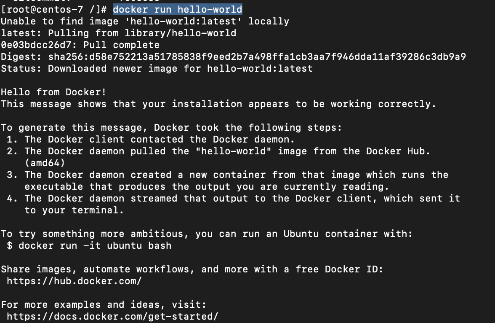
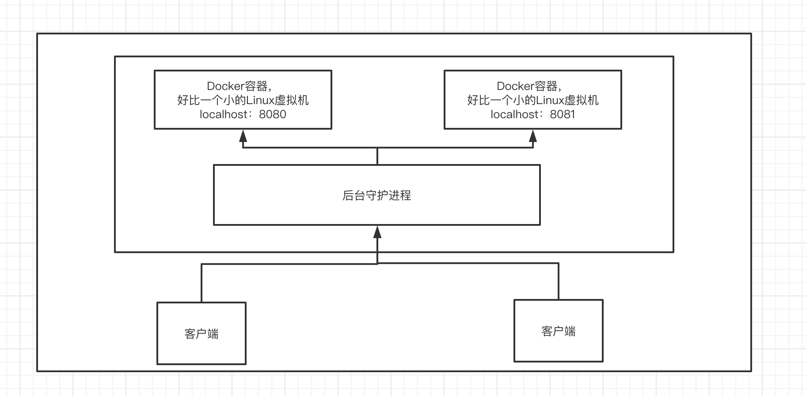
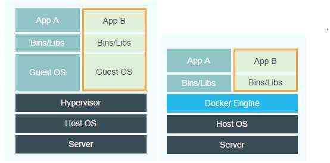

## 安装使用

```shell
# 1、卸载旧的版本
yum remove docker \
                  docker-client \
                  docker-client-latest \
                  docker-common \
                  docker-latest \
                  docker-latest-logrotate \
                  docker-logrotate \
                  docker-engine
# 2、需要的安装包
yum install -y yum-utils
# 3、设置仓库镜像
yum-config-manager \
    --add-repo \
    https://download.docker.com/linux/centos/docker-ce.repo

yum-config-manager \
    --add-repo \
    http://mirrors.aliyun.com/docker-ce/linux/centos/docker-ce.repo
# 4、更新软件包的索引
yum makecache fast
# 5、安装Docker ce：社区版 ee：企业版
yum install docker-ce docker-ce-cli containerd.io
# 6、启动Docker
systemctl start docker
# 7、测试是否安装成功
docker version # docker 版本
docker run hello-world # 测试docker 的Hello World程序，如下
```



```shell
# 8、查看镜像
docker images
REPOSITORY          TAG                 IMAGE ID            CREATED             SIZE
hello-world         latest              bf756fb1ae65        6 months ago        13.3kB
```


```shell
# 9、卸载Docker
yum remove docker-ce docker-ce-cli containerd.io
# 10、删除资源
rm -rf /var/lib/docker # 默认资源路径
```


## 底层原理

### Docker是怎么工作的？

Docker是一个C/S结构的系统，Docker的守护进程运行在主机上，通过Socket从客户端访问！

Docker-Server接收到命令



### Docker为什么比VM快

1.Docker有着比虚拟机更少的抽象层，由于Docker不需要Hypervisor实现硬件资源虚拟化，运行在Docker容器上的程序直接使用的都是实际物理机的硬件资源，因此在Cpu、内存利用率上Docker将会在效率上有明显优势。

2.Docker利用的是宿主机的内核，而不需要Guest OS，因此，当新建一个容器时，Docker不需要和虚拟机一样重新加载一个操作系统，避免了引导、加载操作系统内核这个比较费时费资源的过程，当新建一个虚拟机时，虚拟机软件需要加载Guest OS，这个新建过程是分钟级别的，而Docker由于直接利用宿主机的操作系统则省略了这个过程，因此新建一个Docker容器只需要几秒钟。

|            | Docker容器              | 虚拟机（VM）                |
| ---------- | ----------------------- | --------------------------- |
| 操作系统   | 与宿主机共享OS          | 宿主机OS上运行宿主机OS      |
| 存储大小   | 镜像小，便于存储与传输  | 镜像庞大（vmdk等）          |
| 运行性能   | 几乎无额外性能损失      | 操作系统额外的cpu、内存消耗 |
| 移植性     | 轻便、灵活、适用于Linux | 笨重、与虚拟化技术耦合度高  |
| 硬件亲和性 | 面向软件开发者          | 面向硬件运维者              |



## Docker的常用命令

### 帮助命令

```shell
docker version
docker info
```


### 镜像命令

```shell
docker images
REPOSITORY          TAG                 IMAGE ID            CREATED             SIZE
hello-world         latest              bf756fb1ae65        6 months ago        13.3kB

# 各属性含义 
REPOSITORY   镜像的仓库源
TAG					 镜像的标签
IMAGE ID		 镜像的ID
CREATED			 镜像的创建时间
SIZE				 镜像的大小

# 可选参数
-a, --all      # 列出所有镜像
-q, --quiet    # 只显示镜像的id 
```

**Docker Search 搜索镜像**

```shell
docker search mysql -f=STARS=3000
NAME                DESCRIPTION                                     STARS               OFFICIAL      AUTOMATED
mysql               MySQL is a widely used, open-source relation…   9746                [OK]                
mariadb             MariaDB is a community-developed fork of MyS…   3558                [OK]                

# 各属性含义
NAME				镜像的名字
DESCRIPTION	镜像的描述
STARS				镜像的Star数
OFFICIAL		镜像

# 可选参数
-f, --filter		# 过滤
```

**Docker Pull 拉取镜像**

```shell
docker pull mysql
Using default tag: latest						# 默认最新版本
latest: Pulling from library/mysql
8559a31e96f4: Downloading 					# 分层下载，Docker Image的核心，联合文件系统
d51ce1c2e575: Download complete 
c2344adc4858: Download complete 
fcf3ceff18fc: Download complete 
16da0c38dc5b: Download complete 
b905d1797e97: Download complete 
4b50d1c6b05c: Download complete 
571e8a282156: Download complete 
e7cc823c6090: Download complete 
61161ba7d2fc: Download complete 
74f29f825aaf: Download complete 
d29992fd199f: Download complete 
latest: Pulling from library/mysql
8559a31e96f4: Pull complete 
d51ce1c2e575: Pull complete 
c2344adc4858: Pull complete 
fcf3ceff18fc: Pull complete 
16da0c38dc5b: Pull complete 
b905d1797e97: Pull complete 
4b50d1c6b05c: Pull complete 
571e8a282156: Pull complete 
e7cc823c6090: Pull complete 
61161ba7d2fc: Pull complete 
74f29f825aaf: Pull complete 
d29992fd199f: Pull complete 
Digest: sha256:fe0a5b418ecf9b450d0e59062312b488d4d4ea98fc81427e3704f85154ee859c		# 签名
Status: Downloaded newer image for mysql:latest
docker.io/library/mysql:latest			# 真实地址（等价于上面的mysql）

# 可选参数
docker pull mysql[:TAG]			# TAG 可选参数，可选择版本：5.7

# 例：
docker pull mysql:5.7
5.7: Pulling from library/mysql
8559a31e96f4: Already exists 
d51ce1c2e575: Already exists 
c2344adc4858: Already exists 
fcf3ceff18fc: Already exists 
16da0c38dc5b: Already exists 
b905d1797e97: Already exists 
4b50d1c6b05c: Already exists 
0a52a5c57cd9: Pull complete 
3b816a39d367: Pull complete 
13ee22d6b3bb: Pull complete 
e517c3d2ba35: Pull complete 
Digest: sha256:ea560da3b6f2f3ad79fd76652cb9031407c5112246a6fb5724ea895e95d74032
Status: Downloaded newer image for mysql:5.7
docker.io/library/mysql:5.7

```

**Docker rmi 删除镜像**

```shell
# docker rmi 
-f		# 强制
docker rmi -f d05c76dbbfcf			# 删除指定ID的镜像
Untagged: mysql:5.7
Untagged: mysql@sha256:ea560da3b6f2f3ad79fd76652cb9031407c5112246a6fb5724ea895e95d74032
Deleted: sha256:d05c76dbbfcf3e1d969eecc04d0aa461e0f95204f6833f62edb73cca7b62fcd4
Deleted: sha256:840de3dd46e7b6203f85075d3bbc784b151e0de21f77dfa37744fc8edeaf766b
Deleted: sha256:7438475d185887f36358065f793c5699b459bc13271aee0b606b9d68230452ef
Deleted: sha256:323859cca1e70d6db23f15dd1d6c0c66e08f116147477663f3be2d94c89ba3a8
Deleted: sha256:14a1c67348bc38b8f7316be7993dea0c03c5375e7728dcffb2da90ceed74c1f0

docker rmi -f d05c76dbbfcf 6e447ce4863d			# 删除多个指定ID的镜像

docker rmi -f $(docker images -aq)		# 传参批量删除
```


### 容器命令

**我们有了镜像才可以创建容器，下载一个Linux镜像来测试**

```shell
docker pull centos
```

**新建容器并启动**

```shell
docker run [可选参数] image

# 参数说明
--name="Name" 			容器的名字 tomcat01，tomcat02 用来区分容器
-d									后台方式运行
-it									使用交互方式运行，进入容器查看内容
-p									指定容器的端口	-p	8080:8080
		-p	ip:主机端口:容器端口
		-p	主机端口:容器端口（常用）
		-p	容器端口
		容器端口
-P									随机指定端口


# 启动并进入容器
joker@MacBook-Pro-4 ~ % docker run -it centos /bin/bash
[root@ec42bec6041b /]#			# 容器内部的centos

exit					# 从容器中退出
```

**列出运行的容器**

```shell
# docker ps
			# 列出当前正在运行的容器
-a		# 列出当前正在运行的容器+历史运行过的容器
-n=?	# 显示最近创建的容器
-q		# 只显示容器的编号

joker@MacBook-Pro-4 ~ % docker ps
CONTAINER ID        IMAGE               COMMAND             CREATED             STATUS              PORTS               NAMES
joker@MacBook-Pro-4 ~ % docker ps -a
CONTAINER ID        IMAGE               COMMAND                  CREATED             STATUS                         PORTS               NAMES
ec42bec6041b        centos              "/bin/bash"              2 minutes ago       Exited (0) 8 seconds ago                           epic_blackwell
79bb39dd076d        bf756fb1ae65        "/hello"                 About an hour ago   Exited (0) About an hour ago                       thirsty_ritchie
joker@MacBook-Pro-4 ~ % docker ps -aq
ec42bec6041b
79bb39dd076d
```

**退出容器**

```shell
exit					# 停止容器并退出
Ctrl + P + Q	# 不停止容器退出
```

**删除容器**

```shell
# docker rm 
-f		# 强制
docker rm 容器ID									# 删除指定ID的容器，不能删除正在运行的容器
docker rm -f 容器ID 容器ID					# 删除多个指定ID的容器
docker rm -f $(docker ps -aq)			# 删除所有的容器
docker ps -a -q|xargs docker rm		# 删除所有的容器
```

**启动和停止容器**

```shell
docker start 容器id
docker restart 容器id
docker stop 容器id
docker kill 容器id
```

### 常用其他命令

后台启动容器

```shell
# docker run -d 镜像名

docker run -d centos
# docker ps 发现centos停止了
# docker容器使用后台运行，必须有一个前台进程，docker没有发现就会自动停止
# 容器启动后发现自己没有提供服务，就会立刻停止
```

**查看日志命令**

```shell
# docker logs [可选参数] 容器id
-f						# 随时打印接下来的日志
-t						# 显示时间戳
--tail num		# 显示日志条数
```

**查看容器中的进程信息**

```shell
# 命令 docker top 容器id
docker top ec42bec6041b
PID                 USER                TIME                COMMAND
2388                root                0:00                /bin/bash
```

**查看容器中的元数据**

```shell
# 命令 docker inspect 容器id
```

**进入当前正在运行的容器**

```shell
# 命令 docker exec -it 容器id bashShell
	# 通常我们容器都是后台方式运行的，有时候需要进入容器，修改配置
docker exec -it ec42bec6041b /bin/bash

# 方式二
# docker attach 容器id

# docker exec				进入容器后打开一个新的终端
# docker attach			进入容器正在执行的终端，不会开启新的进程

```

从容器内拷贝文件到主机上

```shell
# 命令 docker cp 容器id：容器内地址 目的主机地址
docker cp ec42bec6041b:/home/hello.java /home
```


